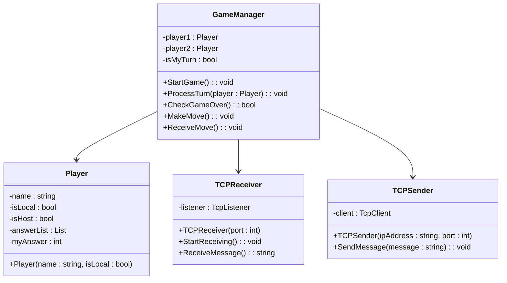

# BattleGame

コンソールアプリで対戦ゲームを作る

# ゲームの内容

- **数字の設定**:
  - コンピュータや対戦相手が 3 桁の数字を設定します。この数字はすべて異なる数字で構成されます。
- **推測**:
  - プレイヤーは 3 桁の数字を推測して、提示します。
- **判定**:
  - 推測した数字に対して「HIT」と「BLOW」でフィードバックが与えられます。
  - **HIT**: 数字と位置が一致している場合。
  - **BLOW**: 数字は正しいが、位置が違う場合。
    例: 正解が「234」で、プレイヤーが「243」と推測した場合、「2」は位置も数字も正しいので 1 HIT、「3」と「4」は位置が違うので 2 BLOW となります。
- **ゲームの目的**:
  - プレイヤーはフィードバックを基に、何度か推測を行い、すべての数字と位置を正確に当てることを目指します。
- **ゲーム終了**:
  - すべての数字と位置が正確になればプレイヤーの勝ちです。

# 実装

## 開発ルール

- 作業手順は以下の通り
  1. イシュー発行
  1. ローカルブランチ作成
  1. コミット＆プッシュ
  1. マージリクエスト
  1. マージ＆イシュークローズ
  1. 1 に戻る
- ブランチ名：`#${イシュー番号}_${作業内容}`
- コミットコメント：`#${イシュー番号}_${作業内容}`

## クラス

### GameManager

#### プロパティ:

player1 : Player : ゲーム内で「自分」を表す Player オブジェクトです。ローカルプレイヤーとしての情報や状態を管理します。 
player2 : Player : 相手プレイヤーを表す Player オブジェクトです。リモートプレイヤーとして、相手の情報や状態を管理します。 
isMyTurn : bool : 現在のターンが自分かどうかを示すフラグです。true のときは自分のターン、false のときは相手のターンです。このフラグに基づいて入力や処理を制御します。
メソッド:

#### StartGame() : void :

ゲームを初期化し、ゲームのメインループを開始します。 
どちらが先にプレイするかを決め、ターン制のゲーム進行を行います。 
ゲーム終了条件が満たされるまで、player1 と player2 のターンを交互に処理します。 
例として、最初に自分のターンを true に設定し、相手のターンが終了したら isMyTurn を true に戻すことで次のターンを進めます。 

#### ProcessTurn(player : Player) : void :

受け取ったプレイヤーが自分 (isLocal = true) であれば、入力を受け付けて相手にメッセージを送信します。リモートプレイヤーであれば、メッセージを受信してそれを処理します。 
このメソッドを使って、各プレイヤーのターンに行う処理（入力、通信、推測結果の反映など）を実行します。 

#### CheckGameOver() : bool :

ゲーム終了条件をチェックするメソッドです。例えば、どちらかのプレイヤーが正解を当てた場合や、ターン数が上限に達した場合など、ゲーム終了を判断します。 
true を返すとゲームループを終了し、結果を表示します。 

#### MakeMove() : void :

自分のターンで行う動作です。ユーザーに推測値を入力させ、その値を相手に送信します。TCPSender を使ってメッセージを送信します。 
例：プレイヤーに「Enter your guess:」とプロンプトを表示し、推測を入力させます。 
表形式に今までの入力を出力できるようにエンハンスしたい。

#### ReceiveMove() : void :

相手プレイヤーの推測値を受信するためのメソッドです。TCPReceiver を使用して相手からのメッセージを受信し、その推測値をゲームに反映します。 
例：相手のターンで「Opponent guessed: 1234」などのメッセージが表示されます。 
表形式に今までの入力を出力できるようにエンハンスしたい。

### TCPReceiver

#### プロパティ:

listener : TcpListener :指定したポートで TCP 接続を待機するためのリスナーオブジェクトです。このオブジェクトを使って、他のクライアントからの接続要求を待ち受けます。 

#### メソッド: 

#### TCPReceiver(port : int) (コンストラクタ) :

指定されたポート番号で TCP リスナーを初期化します。受信側の通信準備を行います。 
例：new TCPReceiver(12345) とすることで、ポート 12345 で接続待機を開始します。 

#### StartReceiving() : void :

リスナーを開始し、クライアントからの接続を待機します。接続があればクライアントとの通信を処理し、メッセージを受信します。 
メッセージ受信後、クライアントの接続を閉じます。メインループで繰り返し待機し、相手のターンに相手の推測を受け取る際に使われます。 

#### ReceiveMessage() : string :

TCP 接続を確立し、相手からのメッセージを受信します。データをバイト配列で受信し、文字列に変換して返します。 
例：相手の推測値をこのメソッドで受け取ります。 

### TCPSender

#### プロパティ: 

#### client : TcpClient :

サーバーまたはリモートプレイヤーに接続するためのクライアントオブジェクトです。送信側の通信を管理します。 

#### メソッド:

#### TCPSender(ipAddress : string, port : int) (コンストラクタ) :

指定された IP アドレスとポート番号に接続するためのクライアントを初期化します。ゲーム内でプレイヤーが推測した値などを相手に送信する準備を行います。 

#### SendMessage(message : string) : void :

接続先にメッセージを送信します。TCP クライアントを使って、相手の IP アドレスとポート番号にメッセージを送ります。 
例：自分の推測値を相手に送信する際に使用されます。 

### Player

#### プロパティ:

name : string :プレイヤーの名前です。表示やログ出力などに使われます。 
例：「Player 1」や「Opponent」などの名前が設定されます。 

isLocal : bool :プレイヤーがローカル（自分）かリモート（相手）かを識別するためのフラグです。true なら自分、false なら相手プレイヤーです。 

#### メソッド:

#### Player(name : string, isLocal : bool, isHost : bool, myAnswer : int) (コンストラクタ) :

プレイヤー名とローカルプレイヤーかどうかのフラグを設定するコンストラクタです。ゲーム開始時に各プレイヤーを初期化します。 
